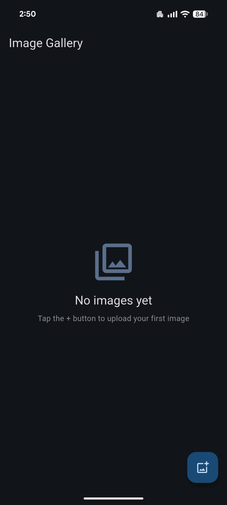
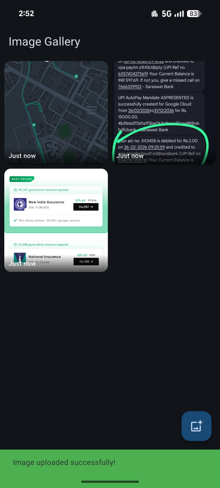
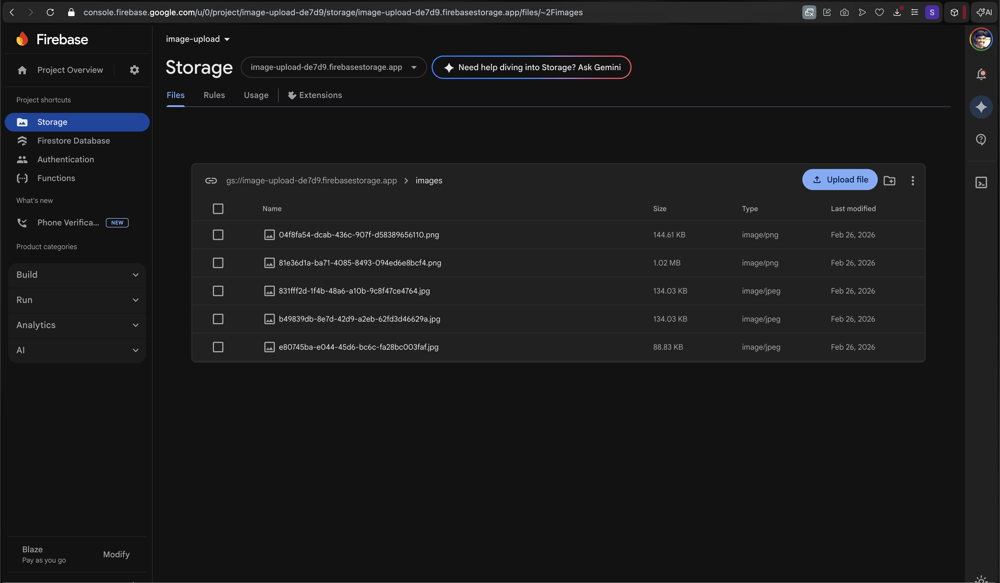
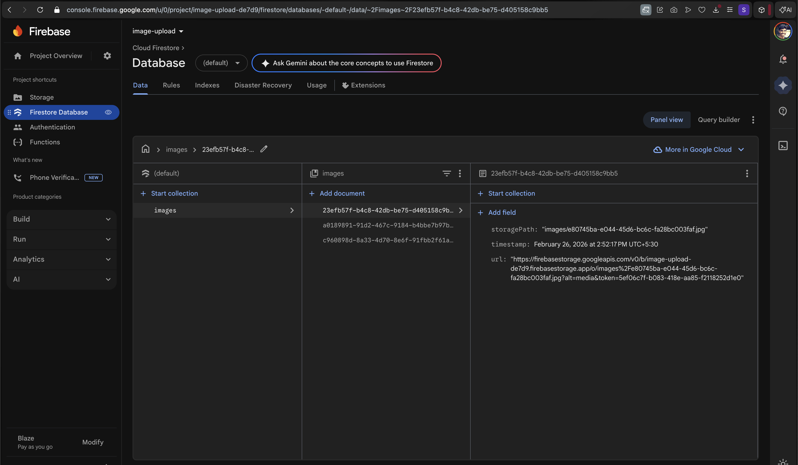

# Flutter Image Upload (Interview Assignment)

Simple cross-platform Flutter app (Android, iOS, Web) to:

- Pick image (mobile gallery / web file picker)
- Upload image to Firebase Storage
- Save image metadata (`url`, `timestamp`, `storagePath`) in Firestore
- Show uploaded images in real-time gallery

## Tech Stack

- Flutter
- Firebase Core, Firestore, Storage
- Riverpod (simple providers)
- `image_picker` (mobile), `file_picker` (web)

## Project Structure (Clean Architecture)

- `lib/features/gallery/domain` - entities, repository contract, use case
- `lib/features/gallery/data` - models, datasources, repository implementation
- `lib/features/gallery/presentation` - providers, screen, widgets

## Screenshots

### Mobile

### Firebase Console

## Screen Recording

- [Watch Recording](assets/screenshots/app-web-screenrecording.mov)

Note: current rules are intentionally simple for assignment/demo use.
